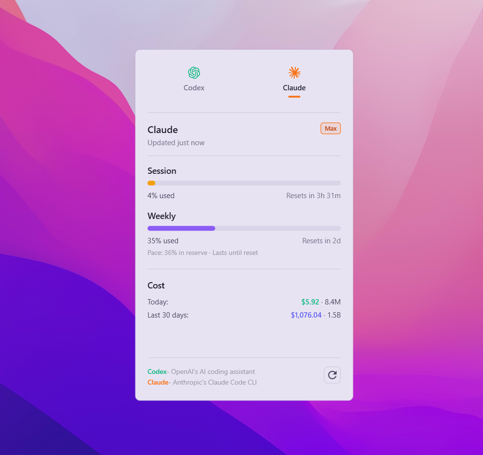
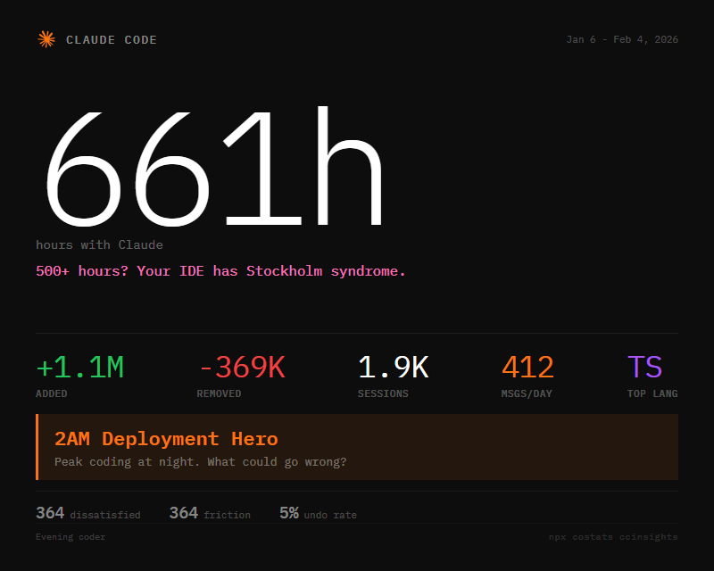

# costats 

A lightweight Windows tray app that shows live status, plus token usage and spend, for AI coding providers like Codex and Claude Code, optionally GitHub Copilot.

<p align="center">
  
</p>

## What it shows
- Session and weekly utilization with reset timers and pace indicators.
- Daily tokens + cost and 30-day rolling tokens + cost.
- Overage or credit balance when available.
- One-tap tray widget and a global hotkey (`Ctrl+Alt+U`).

## Install

**One-step PowerShell (technical)**
```powershell
iwr -useb https://raw.githubusercontent.com/fmdz387/costats/master/scripts/install.ps1 | iex
```
Downloads the latest release, installs per-user and creates a Start Menu shortcut.
Portable installs now auto-check for updates in the background on startup and stage updates safely for the next launch.

**From source:** see **Build** below.

## Usage
- Click the tray icon to open the widget.
- Press `Ctrl+Alt+U` to toggle the widget (configurable).
- Open Settings to set refresh interval or start at login.

## Insights Card CLI
Generate a shareable Claude Code Insights card from `report.html` ([full docs](tools/insights-cli/README.md)):

<p align="center">
  
</p>

```powershell
npx costats ccinsights
```

By default it reads `~/.claude/usage-data/report.html` and writes the PNG to `~/.costats/images/costats-insights.png`.

Optional flags:
- `--json <path>` to export the extracted JSON alongside the PNG.
- `--no-open` to avoid opening the image viewer.
Requires an active Claude Code OAuth login (uses `~/.claude/.credentials.json`).
First run may download a Playwright Chromium binary for rendering.

## Configuration
Settings are stored at:
`%LOCALAPPDATA%\costats\settings.json`

Common settings:
- `RefreshMinutes` (default 5)
- `Hotkey` (default `Ctrl+Alt+U`)
- `StartAtLogin` (true/false)
- `CopilotEnabled` (true/false)

Optional environment variable:
- `CODEX_HOME` to point to a custom Codex config/logs directory.

## GitHub Copilot (experimental)
1. Create a **classic** GitHub personal access token with the **`copilot`** and **`read:user`** scopes.
2. Open Settings → Copilot, enable the provider, and paste the token.
3. Tokens are stored in Windows Credential Manager (not in `settings.json`).
4. This relies on an unofficial GitHub endpoint and may break without notice.

## Updates
- Portable ZIP installs (`install.ps1`): on startup, costats checks GitHub Releases (default every 6 hours), stages a matching architecture update and applies it on the next startup via an external updater process so binaries can be replaced safely.
- Integrity: if release checksum assets are present (`.sha256`), costats validates SHA-256 before staging.
- Rollback safety: updater swap uses backup/rollback logic and writes logs to `%LOCALAPPDATA%\costats\updates\apply-update.log`.
- MSIX/AppInstaller installs: `costats.appinstaller` uses OnLaunch checks and background update tasks managed by Windows App Installer.
- Update policy can be configured in `appsettings.json` under `Costats:Update` (`Enabled`, `Repository`, `CheckIntervalHours`, `AllowPrerelease`, `ApplyStagedUpdateOnStartup`).

## Data sources
- Codex usage: OAuth usage endpoint via `~/.codex/auth.json` (or `CODEX_HOME`), with local logs as a fallback for estimates.
- Claude usage: OAuth usage endpoint via `~/.claude/.credentials.json`, with local logs as a fallback for estimates.
- Copilot usage: GitHub Copilot usage endpoint via a personal access token stored in Windows Credential Manager.
- Token + cost estimates: local JSONL logs from `~/.codex/sessions` and `~/.claude/projects`.

## Security & privacy
- Reads local auth and log files on your machine.
- Sends requests only to provider APIs to fetch usage data; no third-party telemetry.

## Performance
- Background polling at a fixed interval (default 5 minutes).
- Single-instance, tray-first UI designed to stay lightweight.

## Build
Requires a .NET SDK that supports `net10.0-windows`.
Versioning is centralized via `src/Directory.Build.props` (`VersionPrefix` in `major.minor.patch` format).

```powershell
# Build
dotnet build .\costats.sln -c Release

# Publish portable single-file binaries (x64 + arm64), with .sha256 checksums
.\scripts\publish.ps1
```

## Linux/MacOS
- [CodexBar](https://github.com/steipete/CodexBar) is an original MacOS/Linux app for stats.
